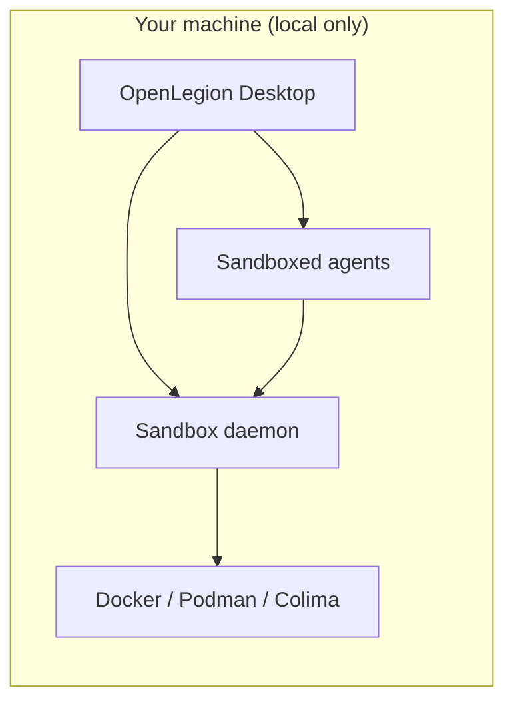
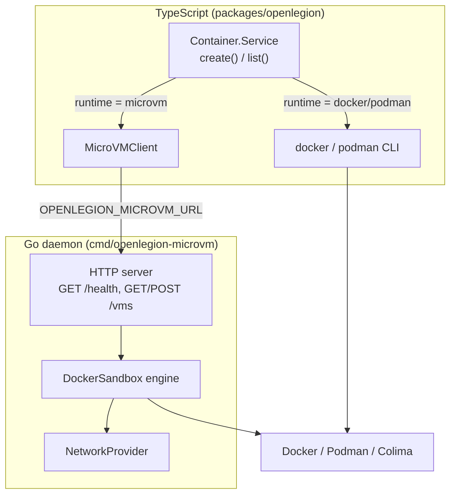

# OpenLegion

**Local desktop platform for running Docker workloads with sandboxed, security-aware agents.**

OpenLegion helps **DevOps engineers** and **security teams** design container images safely, spin up multiple containers, and get guided help from AI agents—without sending your environment to the cloud. Think **Docker Desktop**, but oriented toward secure defaults, clearer workflows, and agents that understand your compose files, Dockerfiles, and runtime posture.

OpenLegion is fork of [OpenCode](https://github.com/anomalyco/opencode) and diverges toward **local Docker management + security agents**. It is not affiliated with Docker Inc. or OpenCode. Third-party projects with “opencode” in the name are also unrelated.

MIT — see [LICENSE](./LICENSE). Upstream OpenCode remains MIT; attribution appreciated.

---

Everything runs **on your machine**. There is no hosted control plane; data, credentials, and workloads stay local.

[](https://github.com/dorman/Open_Legion/actions/workflows/publish.yml)

---

## Who this is for

| Audience             | What you get                                                                                                                                        |
| -------------------- | --------------------------------------------------------------------------------------------------------------------------------------------------- |
| **DevOps engineers** | A desktop surface to run and manage many containers, with agents that help author Dockerfiles, Compose stacks, and run/debug commands in context.   |
| **Security teams**   | Workflows that bias toward least privilege, explicit approvals, and reviewable changes before images or containers go live on a laptop or lab host. |

OpenLegion is **not** a SaaS product. It is a **local-only** management and agent platform you install and run yourself.

---

## The product vision



1. **Desktop-first** — Primary experience is the Electron app (`bun run dev:desktop`): see containers, projects, and agent sessions in one place.
2. **Many containers** — Run and manage multiple Docker containers (and stacks) from that UI, similar in spirit to Docker Desktop but with agent-assisted flows.
3. **Agents that help** — Sandboxed agents assist with writing Dockerfiles, hardening images, explaining `docker`/`compose` output, and proposing fixes—always subject to permission rules and your approval.
4. **Security by design** — Agents run with constrained scope; risky operations require confirmation. The goal is secure **design** and **bring-up**, not unconstrained shell access on the host.

Branding uses a Robin Hood motif: defend operators and workloads against opaque, insecure defaults—give teams control on their own hardware.

---

## Sandbox runtime

OpenLegion ships an early **sandbox runtime** that wraps Docker-compatible workloads in **per-container network isolation**. The Go daemon is named `openlegion-microvm`; today it provisions **isolated Docker networks** (not Firecracker/Kata VMs yet). The `Provider` interface is designed so the same boundary can later be backed by Lima, Kata, or other runtimes.

### How it works

Each sandboxed workload gets:

1. A unique sandbox ID (`sandbox-{hex}`)
2. A dedicated bridge network (`openlegion-sandbox-{id}`)
3. A metadata directory under `~/.openlegion/sandboxes/{id}/`
4. A Docker container attached **only** to that network, labeled `openlegion.sandbox.id={id}` and named `openlegion-{id}-{workload}`

Create provisions the container but does **not** start it. Use `docker start` (or a future lifecycle API) to run the workload.



### Runtime selection

`Container.Service` auto-detects the best available runtime:

1. **microvm** — sandbox daemon responds at `OPENLEGION_MICROVM_URL`
2. **docker** — `docker` on PATH
3. **podman** — `podman` on PATH

Force a runtime with `OPENLEGION_CONTAINER_RUNTIME=microvm|docker|podman`.

| Runtime | Isolation | Create path |
| ------- | --------- | ----------- |
| `microvm` | Per-workload Docker network via daemon | `POST /vms` |
| `docker` | Standard `docker container create` | CLI subprocess |
| `podman` | Standard `podman container create` | CLI subprocess |

Colima works through the Docker-compatible CLI—no special integration required.

### Quick start (sandbox daemon)

```bash
# Build and start the daemon (listens on 127.0.0.1:7420 by default)
go build -o openlegion-microvm ./cmd/openlegion-microvm/
./openlegion-microvm

# Health check (requires docker or podman to respond to `info`)
curl http://127.0.0.1:7420/health

# Create a sandboxed container (created, not started)
curl -X POST http://127.0.0.1:7420/vms \
  -H 'Content-Type: application/json' \
  -d '{
    "image": "alpine:latest",
    "name": "workload",
    "env": {"FOO": "bar"},
    "ports": [{"host": "8080", "container": "80"}],
    "volumes": [{"host": "/tmp/data", "container": "/data", "readOnly": true}],
    "command": ["sleep", "3600"]
  }'

# List sandbox containers
curl http://127.0.0.1:7420/vms

# Start the container with standard Docker tooling
docker start openlegion-sandbox-<id>-workload
```

Use Podman as the daemon's container backend:

```bash
OPENLEGION_DOCKER_RUNTIME=podman ./openlegion-microvm
```

### Environment variables

| Variable | Default | Purpose |
| -------- | ------- | ------- |
| `OPENLEGION_CONTAINER_RUNTIME` | auto-detect | Force `microvm`, `docker`, or `podman` |
| `OPENLEGION_MICROVM_URL` | `http://127.0.0.1:7420` | Daemon URL (TypeScript client) |
| `OPENLEGION_MICROVM_LISTEN` | `127.0.0.1:7420` | Daemon listen address (Go) |
| `OPENLEGION_DOCKER_RUNTIME` | `docker` | Container CLI used by the Go daemon |
| `OPENLEGION_SANDBOX_ROOT` | `~/.openlegion/sandboxes` | Per-sandbox metadata directories |

### Key paths

```
cmd/openlegion-microvm/          # Sandbox daemon entrypoint
internal/
  daemon/                        # HTTP server (GET /health, GET/POST /vms)
  engine/docker_sandbox.go       # Create/list via isolated networks
  sandbox/network.go             # NetworkProvider — per-workload envelope
  docker/                        # Docker/Podman CLI wrapper
packages/openlegion/src/container/
  index.ts                       # Container.Service (create, list)
  microvm-client.ts              # HTTP client to the Go daemon
  schema.ts                      # CreateInput, Info, Runtime schemas
```

### TypeScript API (programmatic)

`Container.Service` is available as an Effect service for agents and server code. It is not yet exposed as a CLI subcommand or HTTP route on `dev`.

```typescript
import { Container } from "@/container"
import { Effect } from "effect"

const program = Effect.gen(function* () {
  const container = yield* Container.Service
  const created = yield* container.create({ image: "nginx:alpine", name: "web" })
  const all = yield* container.list()
  return { created, all }
})
```

---

## What exists today vs. what we are building

This repo is a **fork of [OpenCode](https://github.com/anomalyco/opencode)**. The agent runtime, permissions model, desktop shell, and HTTP API are largely in place. **Sandbox runtime and Docker-centric management UI are actively being built.**

### Available now

| Component | Command / location | Notes |
| --------- | ------------------ | ----- |
| **Sandbox daemon** | `go build -o openlegion-microvm ./cmd/openlegion-microvm/` | Per-workload network isolation via `POST/GET /vms` |
| **Container service** | `packages/openlegion/src/container/` | Effect `create()` / `list()` across microvm, docker, podman |
| **Desktop app** | `bun run dev:desktop` | Electron UI—foundation for the management platform |
| **CLI / TUI** | `bun run dev` | Terminal agent (upstream OpenCode behavior) |
| **Web UI** | `bun run dev:web` | Same app shell in the browser for development |
| **Agent runtime** | `packages/openlegion` | Sessions, tools, providers, MCP, plugins |
| **Permissions** | `~/.openlegion` | Gates for files, shell, and tools |
| **Built-in agents** | TUI: **Tab** to switch | `build`, `plan` (read-only + asks before shell), `general` (`@general`) |

Config and state: **`~/.openlegion/`** (global), optional **`.openlegion/`** per repo. See [`.openlegion/`](./.openlegion/) for sample agents and commands.

### Roadmap (product focus)

- [ ] **CLI container commands** — `openlegion container create/list` wired to `Container.Service`
- [ ] **HTTP lifecycle API** — start, stop, remove sandbox containers from the local server
- [ ] **Docker integration in desktop** — list/start/stop containers and compose projects from the UI
- [ ] **Agent execution in sandboxes** — agents scoped to container filesystem/network context
- [ ] **True microVM backends** — swap `NetworkProvider` for Lima/Kata/Firecracker
- [ ] **Secure image workflows** — guided Dockerfile/Compose authoring, baseline hardening checks
- [ ] **Security-team views** — audit-friendly session logs and policy hints for common misconfigurations

The [`packages/containers`](./packages/containers/) directory is **CI build images** for GitHub Actions only—not the end-user runtime.

---

## How it compares

|                   | Docker Desktop           | OpenLegion (target)                                        |
| ----------------- | ------------------------ | ---------------------------------------------------------- |
| **Runs where**    | Local                    | **Local only**                                             |
| **Primary goal**  | Run containers           | Run containers **and** help secure/design them with agents |
| **AI assistance** | Limited / separate tools | **Built-in**, permissioned, sandboxed agents               |
| **Network isolation** | Manual compose/network setup | **Per-workload sandbox networks** via daemon          |
| **Audience**      | General developers       | **DevOps + security** teams                                |

---

## Requirements

- [Bun](https://bun.sh) **1.3.14+**
- [Go](https://go.dev) **1.22+** (to build the sandbox daemon)
- [Docker](https://docs.docker.com/get-docker/), [Podman](https://podman.io), or [Colima](https://github.com/abiosoft/colima) for container workloads
- macOS, Linux, or Windows (desktop development is most tested on **macOS** today)

---

## Quick start

```bash
git clone https://github.com/dorman/Open_Legion.git
cd Open_Legion
bun install

# Management desktop (primary product direction)
bun run dev:desktop

# Terminal agent (also useful for debugging)
bun run dev

# Optional: sandbox daemon for isolated container workloads
go build -o openlegion-microvm ./cmd/openlegion-microvm/
./openlegion-microvm
```

Future CLI install (when published): `npm i -g openlegion-ai`.

---

## Agents and security

Agents inherit OpenCode’s model and will tighten for container work:

| Agent       | Role                                                                          |
| ----------- | ----------------------------------------------------------------------------- |
| **build**   | Implementation agent—edits and commands allowed per your permission config    |
| **plan**    | Read-only analysis—ideal for reviewing Dockerfiles and compose before changes |
| **general** | Multi-step search subagent (`@general` in prompts)                            |

**Security direction:** default-deny tooling, explicit approval for shell and deploy actions, sandboxed context per container/project, and local-only storage of secrets and session history—no telemetry requirement for core use.

---

## Monorepo layout

```
cmd/
  openlegion-microvm/   # Go sandbox daemon (per-workload network isolation)
internal/
  daemon/               # HTTP API for /health and /vms
  engine/               # DockerSandbox create/list engine
  sandbox/              # NetworkProvider envelope boundary
  docker/               # Docker/Podman CLI wrapper
packages/
  openlegion/           # CLI, TUI, local HTTP server, agent + tool runtime
  core/                 # Shared logic (permissions, DB, providers, …)
  app/                  # SolidJS UI (used inside desktop)
  desktop/              # Electron management shell
  ui/                   # Components and brand assets
  plugin/               # Plugin SDK
  sdk/                  # JS client for the local API
  containers/           # CI images only (not the product runtime)
```

Default branch: **`dev`**. Conventions: [AGENTS.md](./AGENTS.md), contributions: [CONTRIBUTING.md](./CONTRIBUTING.md).

---

## Configuration

| Path             | Purpose                                       |
| ---------------- | --------------------------------------------- |
| `~/.openlegion/` | Global settings, auth, custom agents/commands |
| `.openlegion/`   | Per-project overrides                         |
| `~/.openlegion/sandboxes/` | Per-sandbox metadata from the daemon |

Environment variables: `OPENLEGION_*` prefix (e.g. `OPENLEGION_BIN_PATH`, `OPENLEGION_CONTAINER_RUNTIME`).

---

## Development

| Command               | Description            |
| --------------------- | ---------------------- |
| `bun run dev:desktop` | Desktop management app |
| `bun run dev`         | CLI / TUI agent        |
| `bun run dev:web`     | Web UI dev server      |
| `bun run lint`        | Oxlint                 |
| `bun run typecheck`   | Turbo typecheck        |
| `go build -o openlegion-microvm ./cmd/openlegion-microvm/` | Build sandbox daemon |

Regenerate app icons after updating `packages/ui/src/assets/brand/openlegion-icon.png`:

```bash
cd packages/desktop
bun ./scripts/generate-brand-icons.ts
bun ./scripts/copy-icons.ts dev
```

## Contributing

Security, Docker, sandbox runtime, and desktop UX contributions are especially welcome. Read [CONTRIBUTING.md](./CONTRIBUTING.md). Commit format: `type(scope): summary` (e.g. `feat(container): add sandbox daemon lifecycle API`).
