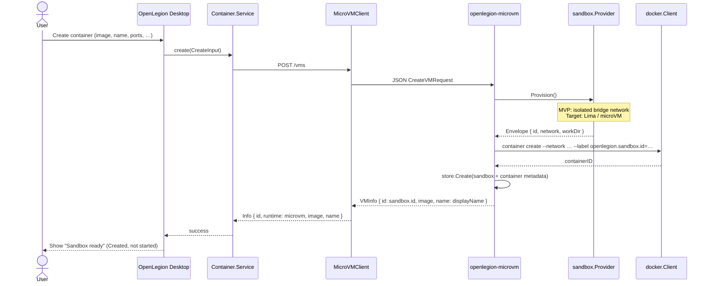
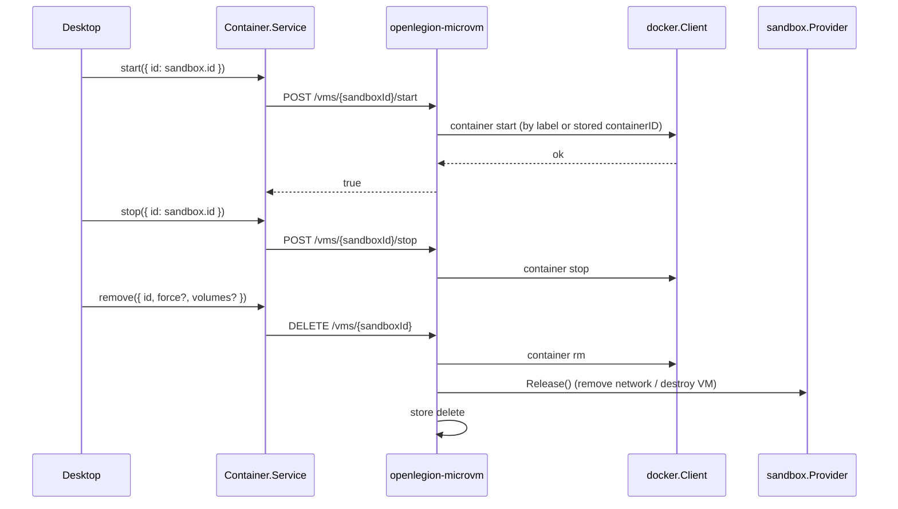
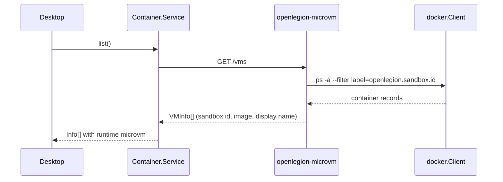

# Desktop sandbox create flow

Design for routing **manual container creates in OpenLegion Desktop** through the sandbox control daemon so each workload gets its own isolation envelope (microVM target, network sandbox MVP today).

---

## Principles

1. **Desktop never calls host `docker` directly** for user-initiated creates (default product path).
2. **Sandbox envelope** is the primary identity OpenLegion stores and displays (`sandbox-id`).
3. **Container** is the workload inside the envelope (Docker/containerd object inside the sandbox VM or network).
4. **Daemon is the control plane** — Desktop and `Container.Service` talk HTTP to `openlegion-microvm`, not to the engine CLI.
5. **Provider is swappable** — `sandbox.NetworkProvider` (today) → `sandbox.LimaProvider` / Kata / Apple VZ (target).

---

## Layer model

```
┌─────────────────────────────────────────────────────────────┐
│  OpenLegion Desktop (Electron)                              │
│  - Create container UI                                      │
│  - Sandbox status / security badge                          │
└───────────────────────────┬─────────────────────────────────┘
                            │ local HTTP (OpenLegion server)
                            ▼
┌─────────────────────────────────────────────────────────────┐
│  Container.Service (packages/openlegion/src/container)      │
│  - runtime: microvm (default for Desktop manual creates)    │
│  - MicroVMClient → daemon HTTP                              │
└───────────────────────────┬─────────────────────────────────┘
                            │ POST/GET http://127.0.0.1:7420
                            ▼
┌─────────────────────────────────────────────────────────────┐
│  openlegion-microvm daemon (Go)                             │
│  - Provision sandbox envelope                               │
│  - Create/start/stop/remove inner container                 │
│  - Registry + Docker label index                            │
└───────────────────────────┬─────────────────────────────────┘
                            │
              ┌─────────────┴─────────────┐
              ▼                           ▼
┌──────────────────────────┐   ┌──────────────────────────────┐
│  sandbox.Provider        │   │  docker.Client               │
│  (network / Lima / …)    │   │  (Colima / podman / in-VM)   │
└──────────────────────────┘   └──────────────────────────────┘
```

---

## Identity model

| Field | Owner | Meaning | Example |
|-------|-------|---------|---------|
| `sandbox.id` | Daemon | Isolation envelope (API primary key) | `sandbox-d2e9a518add04208` |
| `container.id` | Docker/engine | Inner container ID | `2f4821ddb0fc` |
| `container.name` | Docker/engine | Scoped runtime name | `openlegion-sandbox-…-demo` |
| `display.name` | User / Desktop | Friendly label in UI | `demo` |
| `runtime` | OpenLegion TS | Always `microvm` on sandbox path | `microvm` |

**Desktop should key rows on `sandbox.id`**, not Docker container id. Container id is for debug/advanced views.

---

## Create flow (target)



### Desktop default after create

- Status: **Created** (container exists, not running) unless user opts into “Create and start”.
- Badge: **Isolated sandbox** (microVM when provider upgrades).
- Primary id in UI: **sandbox id**; expand for container id / network name.

---

## Start / stop / remove (planned)

Today the daemon only implements **create + list**. Desktop needs full lifecycle.



Align with `origin/cursor/container-create-method-1fb0` (`start`, `stop`, `remove` on `Container.Service` + experimental HTTP routes).

---

## List flow



List is **label-driven** so it survives daemon restarts (in-memory store is optional cache).

---

## API shapes

### Layer 1 — Desktop → OpenLegion (`Container.Service`)

Already defined in `packages/openlegion/src/container/schema.ts`:

```typescript
// Create
CreateInput {
  image: string
  name?: string
  env?: Record<string, string>
  ports?: { host: string; container: string }[]
  volumes?: { host: string; container: string; readOnly?: boolean }[]
  command?: string[]
}

// Response
Info {
  id: string              // sandbox.id on microvm path
  runtime: "microvm"
  image: string
  name?: string            // user display name (not docker name)
}
```

Planned (from cursor branch):

```typescript
StartInput  { id: string }
StopInput   { id: string }
RemoveInput { id: string; force?: boolean; volumes?: boolean }
```

### Layer 2 — `Container.Service` → daemon (`MicroVMClient`)

Base URL: `OPENLEGION_MICROVM_URL` (default `http://127.0.0.1:7420`).

| Method | Path | Body | Response |
|--------|------|------|----------|
| `GET` | `/health` | — | `{ "ok": true }` |
| `GET` | `/vms` | — | `VMInfo[]` |
| `POST` | `/vms` | `CreateVMRequest` | `VMInfo` |
| `POST` | `/vms/{id}/start` | — | `{ "ok": true }` *(planned)* |
| `POST` | `/vms/{id}/stop` | — | `{ "ok": true }` *(planned)* |
| `DELETE` | `/vms/{id}` | `RemoveRequest?` | `{ "ok": true }` *(planned)* |

Go types today: `internal/microvm/types/types.go`.

### Layer 3 — daemon internal (not exposed to Desktop)

```go
// Stored per sandbox (internal/daemon/store)
type VM struct {
  ID          string   // sandbox id (API id)
  ContainerID string
  SandboxID   string   // same as ID today
  NetworkName string
  Image       string
  Name        string   // user display name
  // … env, ports, volumes, command
}

// Engine result (internal/engine)
type Result struct {
  ID          string
  ContainerID string
  NetworkName string
  SandboxID   string
}
```

---

## Runtime selection (Desktop)

| Context | Runtime | Notes |
|---------|---------|-------|
| Desktop manual create (default) | `microvm` | Always via daemon |
| CLI / TUI dev | `auto` | daemon → docker → podman |
| Power-user override | `docker` / `podman` | Direct engine, no sandbox |

Env:

- `OPENLEGION_CONTAINER_RUNTIME=microvm` — force sandbox path
- `OPENLEGION_MICROVM_URL` — daemon URL
- `OPENLEGION_DOCKER_RUNTIME` — engine CLI inside daemon (`docker` | `podman`)

Desktop should set `OPENLEGION_CONTAINER_RUNTIME=microvm` when spawning the local server, or pass an explicit runtime flag on create once `CreateInput.runtime` exists.

---

## Sandbox provider evolution

| Phase | Provider | Isolation | Engine |
|-------|----------|-----------|--------|
| **MVP (now)** | `NetworkProvider` | Dedicated Docker bridge per workload | Colima / host docker |
| **v2** | `LimaProvider` | One Lima VM per sandbox | docker inside each Lima VM |
| **v3** | `KataProvider` / Apple VZ | Hardware-virtualized microVM | containerd in guest |

`engine.DockerSandbox` and HTTP routes stay stable; only `sandbox.Provider` changes.

---

## Desktop UI mapping

| User sees | Source field | Notes |
|-----------|--------------|-------|
| Name | `Info.name` | User input (`demo`), not docker name |
| Sandbox ID | `Info.id` | Copy / debug |
| Image | `Info.image` | |
| Status | daemon + docker | Created / Running / Stopped / Error |
| Security | static + provider | “Network isolated” → “MicroVM isolated” |
| Actions | start/stop/remove | Calls sandbox id, not raw container id |

---

## Error handling

| Failure | User message | Layer |
|---------|--------------|-------|
| Daemon down | “Sandbox service unavailable” | `/health` fails |
| Docker/Colima down | “Container engine unavailable” | daemon `docker info` |
| Image pull fail | Engine stderr | docker create |
| VM provision fail | “Could not create isolation environment” | sandbox.Provider |
| Name conflict | “Name already in use” | docker create |

OpenLegion maps daemon `{ "error": "…" }` to `CreateFailedError` / `ListFailedError`.

---

## Implementation checklist

- [x] Go daemon: `/health`, `POST /vms`, `GET /vms`
- [x] Network sandbox + labeled docker create
- [x] `MicroVMClient` + `Container.Service` microvm routing
- [ ] Desktop: spawn daemon on app start (or require user install)
- [ ] Desktop: default `OPENLEGION_CONTAINER_RUNTIME=microvm`
- [ ] Daemon: start / stop / delete + sandbox release
- [ ] `Container.Service`: start / stop / remove on microvm path
- [ ] Align list `name` field (display vs docker name)
- [ ] `sandbox.LimaProvider` for true per-workload VM
- [ ] VM pool / warm sandboxes for latency

---

## Related code

| Component | Path |
|-----------|------|
| Container service | `packages/openlegion/src/container/index.ts` |
| MicroVM HTTP client | `packages/openlegion/src/container/microvm-client.ts` |
| Daemon entry | `cmd/openlegion-microvm/main.go` |
| HTTP handlers | `internal/daemon/server.go` |
| Docker sandbox engine | `internal/engine/docker_sandbox.go` |
| Network sandbox | `internal/sandbox/network.go` |
| Experimental HTTP (cursor branch) | `packages/openlegion/.../experimental.ts` |
